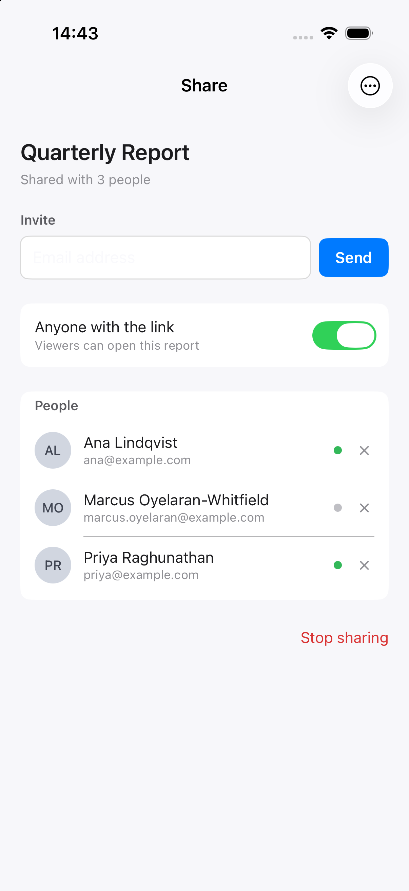
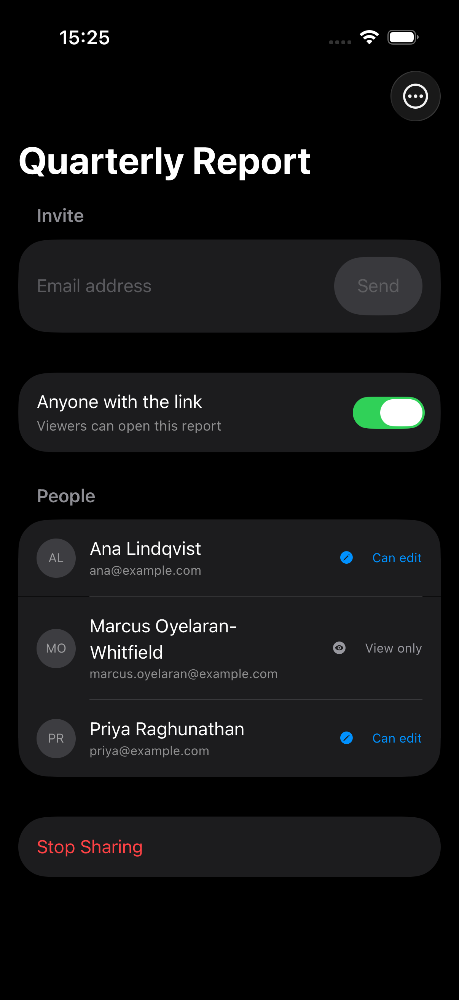

# design-skills

**Design skills your coding agent can read before it writes UI code.**

[](https://github.com/duyanhv/design-skills/actions/workflows/ci.yml)
[](LICENSE)

This repository publishes [Agent Skills](https://agentskills.io) that give a coding agent a working
method for interface work: how to establish the platform and framework it is actually targeting,
which official page answers the decision in front of it, and how to report a review finding with the
source, platform scope, and exceptions attached instead of a stylistic opinion.

It also contains the compiler that produces them. The skills come first below; the pipeline is
documented [further down](#how-the-skills-are-produced).

**Status: experimental.** The bundles are usable for assisted design and review. They have
[known limitations](#verification-and-limitations), the largest being that the published guides
route an agent to guidance rather than carrying the guidance offline.

## See it work on a real screen

[**Worked example: reviewing an iOS share screen**](examples/apple-design-review/) — a SwiftUI
screen reviewed with the `apple-design` skill, then fixed, with real simulator screenshots.

| Before | After |
| --- | --- |
|  |  |

Both captures are the same app in **dark appearance**. The before build ignores it: its light and
dark captures differ in 0.45 % of pixels, and only where the *system* drew them. After, 99.78 %.

The review was run blind. The defect list was written first and kept outside the repository; a
separate agent got only the screen, the skill, and the screenshots, and was not told defects had
been planted. It found 13 of 14 valid planted defects, invented no rule IDs, and reported 4 real
defects nobody planted. It **wrongly dismissed the most interesting one**: it measured the toolbar
button's glass container at 44 × 44 pt from a screenshot and declined to file a target finding, but
a [committed hit-test probe](examples/apple-design-review/probe/main.swift) puts the region that
receives a touch at 39.5 × 26.5 pt. The [review](examples/apple-design-review/REVIEW.md) is
published verbatim and the [scoring](examples/apple-design-review/scoring.md) adjudicates every
item, including the two where my own pre-registered list was wrong rather than the review.

A [second example](examples/apple-design-build/) exercises the other half: an agent *building* a
screen from scratch against an iOS 16 deployment floor, with six pre-registered traps in the task.
It avoided or handled all six, and the result compiles warning-free at that floor.

Two tasks, one run each, no control arm. These are worked examples, not a measurement of
effectiveness.

## Browse the skills

These bundles are committed, so you can read every file on GitHub before installing anything.
Install the whole folder: `SKILL.md` links to the references beside it.

| Skill | Use it for | What is in the bundle | Worked example |
| --- | --- | --- | --- |
| [**apple-design**](skills/apple-design/) | iOS, iPadOS, macOS, watchOS, tvOS, and visionOS UI: component choice, navigation structure, platform-specific behavior, review of an existing screen | [`SKILL.md`](skills/apple-design/SKILL.md) routes by task to six guides — [navigation](skills/apple-design/references/tasks/navigation.md), [actions](skills/apple-design/references/tasks/actions.md), [forms](skills/apple-design/references/tasks/forms.md), [typography](skills/apple-design/references/tasks/typography.md), [appearance](skills/apple-design/references/tasks/appearance.md), [accessibility](skills/apple-design/references/tasks/accessibility.md) — plus [platform/framework context](skills/apple-design/references/context/platforms.md), a [decision-to-page map](skills/apple-design/references/research/topics.md), an [evidence workflow](skills/apple-design/references/review/evidence.md), and `provenance.json` | [Review](examples/apple-design-review/) · [Build](examples/apple-design-build/) · [React Native](examples/react-native-pilot/) |
| [**material-3**](skills/material-3/) | Google Material Design 3 work on Compose, Material Web, or another implementation: theming, component states, adaptive layout | [`SKILL.md`](skills/material-3/SKILL.md) implementation workflow, a [source map](skills/material-3/references/research/sources.md) with per-platform notes, an [evidence workflow](skills/material-3/references/review/evidence.md), `provenance.json` | None yet |
| [lumen-ds](skills/lumen-ds/) | Reading what an extracted bundle looks like. Lumen is an invented design system used as a test fixture, not guidance for a real platform | Generated [`SKILL.md`](skills/lumen-ds/SKILL.md) with routing and an inline index, [extracted reference pages](skills/lumen-ds/references/) carrying rule IDs, source text and citations, `provenance.json`. A larger corpus splits the index into its own `index.md` | n/a (fixture) |

### What these skills decide, and what they send the agent to read

`apple-design` and `material-3` are **original writing**, MIT licensed, published from
[`guidance/`](guidance/). They carry the parts of a design task that do not change between releases:
establishing platform, OS version and framework before choosing a component; separating what a
native control supplies from what the app must implement; checking interaction bounds and states in
code rather than in a screenshot; labelling a personal judgment as a judgment.

They deliberately do **not** restate Apple's or Google's specifications. Anything version-specific
stays upstream and has to be read at the linked source:

- Numeric specifications — sizes, spacing, type scale, contrast and color values, and their units.
- Whether a behavior is required, recommended, or permitted, and the exceptions that change it.
- Platform and OS-version differences, and which component or API exists in the installed library.
- Anything carried by an illustration: visual anatomy, geometry, or state. No images are bundled.

So these two bundles need an agent that can open the linked documentation. Without that access the
skill still applies, but it requires the agent to say which decisions stayed unverified, which the
workflow asks for explicitly.

### Guidelines that are not published here

Apple's HIG and WCAG 2.2 are compiled into full extracted skills — rules carrying the source's own
sentences, platform scope, and citations; the last local build produced 2,347 rules over 158 Apple
pages and 86 success criteria from WCAG. That output is a derivative of text we have no
redistribution license for, so it never enters this repository. `ir/apple-hig/`, `skills/apple-hig/`,
`ir/wcag22/` and `skills/wcag22/` are git-ignored, and `validate` fails the build if they are not.
Build them on your own machine, the same way you would read the guideline in a browser:

```sh
bun run build apple-hig
bun run build wcag22
```

[LICENSING.md](LICENSING.md) records the policy and why WCAG's document license is read this way.

## Install a skill

Install the **whole skill folder**, including references and provenance. Copying only `SKILL.md`
leaves the agent without the guidance it links to.

The published bundles are committed, so cloning is enough to install them. The symlinks below point
at your working copy, so a later `git pull` or rebuild updates what the agent reads.

```sh
git clone https://github.com/duyanhv/design-skills.git
cd design-skills
```

### Codex

```sh
mkdir -p ~/.agents/skills
ln -s "$PWD/skills/apple-design" ~/.agents/skills/apple-design
ln -s "$PWD/skills/material-3" ~/.agents/skills/material-3
```

Codex supports symlinked skill folders in its user skill directory. See the
[official skill documentation](https://learn.chatgpt.com/docs/build-skills).

### Claude Code

```sh
mkdir -p ~/.claude/skills
ln -s "$PWD/skills/apple-design" ~/.claude/skills/apple-design
ln -s "$PWD/skills/material-3" ~/.claude/skills/material-3
```

If a destination already exists, inspect the existing installation before replacing it.

### Example requests

> Use the apple-design skill to review this iOS settings screen. Read the relevant HIG pages,
> then include the source link, platform scope, and exceptions for each finding.

> Use the material-3 skill to plan this adaptive settings form. Check the official guidance and
> our framework’s supported APIs before choosing components and theme roles.

After a local `bun run build wcag22`, the same installation step works for the extracted WCAG bundle:

> Use the wcag22 skill to review this form against Level AA. Explain which criteria apply and
> which checks require testing the running interface.

Other agents can use the generated Markdown when their runtime supports Agent Skills or provides
a way to load the entry file and follow its local references.

## How the skills are produced

Everything below is about the compiler rather than about using a skill.

The build uses source-specific parsers and versioned extraction rules. It makes no LLM calls and
requires no model API key. Requires [Bun](https://bun.sh) 1.2 or later and Git; building Apple HIG
or WCAG also needs internet access.

```sh
bun install --frozen-lockfile

# Rebuild the two published guides from guidance/ (no network or model calls).
bun run build:public

# Extract the large corpora for local use only.
bun run build apple-hig
bun run build wcag22

# Run the whole pipeline against a synthetic source, with no external fetch.
bun run example
```

`build:public` rebuilds `skills/apple-design/` and `skills/material-3/` from `guidance/`, then
validates local links and provenance. CI runs it and fails on any diff, so a published bundle cannot
drift from its authored input. `bun run example` rebuilds [Lumen](skills/lumen-ds/SKILL.md).

### Sources

| Source | Kind | Build command | Output in this repository |
| --- | --- | --- | --- |
| Apple design — original workflow and HIG links | Authored | `bun run build apple-design` | [skills/apple-design/](skills/apple-design/) |
| Google Material Design 3 — original workflow and official links | Authored | `bun run build material-3` | [skills/material-3/](skills/material-3/) |
| [Apple Human Interface Guidelines](https://developer.apple.com/design/human-interface-guidelines/) | Extracted | `bun run build apple-hig` | None; local build only |
| [WCAG 2.2](https://www.w3.org/TR/WCAG22/) and glossary | Extracted | `bun run build wcag22` | None; local build only |
| Lumen Design System — synthetic example | Extracted | `bun run example` | [skills/lumen-ds/](skills/lumen-ds/) |

An **authored** source is original writing kept in `guidance/<id>/`; the build copies it into
`skills/<name>/`, verifies its links and frontmatter, and records file hashes and official URLs in
`provenance.json`. An **extracted** source is crawled, normalized, and split into rules with source
text, platform scope, and citations; only sources whose manifest declares
`license.redistributable: true` may be committed.

Full Material Design 3 extraction and a generic HTML adapter remain planned. The published Material 3
skill is an authored guide, distinct from an extraction adapter and from the MUI React library.

### What gets generated

Extracted skills contain the following artifacts. Authored guides contain `SKILL.md`, original
reference notes, and file hashes plus official URLs in `provenance.json`; they have no extracted
rule IDs, fetch dates, or IR.

```text
skills/<name>/
├── SKILL.md              Task workflow and topic routing
├── index.md              Full index when split from the entry file
├── references/
│   └── <category>/
│       ├── <topic>.md     Rules, context, exceptions, IDs, and citations
│       └── <topic>.tables.md  Large tables, when split out
└── provenance.json       Source URLs, versions, hashes, and fetch dates
```

The compiler also writes structured rules under `ir/<source-id>/`. These record source text,
platform scope, inferred requirement strength, and provenance. WCAG conformance levels are stored
separately so the agent can select criteria for the project's target.

```text
Source manifest → Fetch → Normalize → Extract → Compose → Validate → Evaluate
```

Fetched and normalized content lives in the ignored `.cache/` directory. Changes to extraction
inputs invalidate cached rules; complete builds reconcile removed pages. Incomplete crawls are
refused by default. An explicit `--allow-partial` build carries an incomplete-build warning.

### Publish Markdown to the Git tree

From a clean working tree with a configured `origin` and push access:

```sh
bun run publish:skills
```

This command builds sources marked `license.redistributable: true`, validates their output,
commits changes under `skills/<name>/` (plus `ir/<source-id>/` for extracted sources), and pushes the current
branch to `origin`. It skips local-only sources and creates no empty commit when output is unchanged.

To select an eligible source or commit locally for review:

```sh
bun run publish:skills apple-design material-3
bun run publish:skills apple-design material-3 --no-push
```

`--no-push` still creates a local commit when output changes. Apple Design, Material 3, and the
Lumen example are eligible sources. [The publishing guide](skills/README.md) describes failure handling and folder contents.

## Verification and limitations

```sh
bun run check              # Typecheck, tests, synthetic e2e, validator probes, manifest and doc-link checks
bun run docs               # Relative doc links: target exists, git publishes it, the anchor resolves
bun run docs:negative      # Reintroduces each broken-link defect and asserts the matching case fails
bun run links              # Official links in the authored guides still resolve; needs network
bun run links:negative     # Stub-server guards: an unidentifiable or merged page must not verify
bun run specs              # Every measurement in guidance/ traces to a verified record
bun run records            # Records still match the live source; needs network
bun run eval apple-hig     # Assertions about selected rules and their rendered output
bun run coverage           # Heuristic content-loss scan; needs local build caches
bun run fidelity           # Per-sentence verbatim scan of source against shipped references
bun run budget             # Retrieval cost: entry, index, pages, routing rows, cost to first decision
bun run trace              # Selected audit assertions; needs Apple HIG and WCAG builds
bun run trace:negative     # Reintroduces each defect and asserts the matching trace check fails
```

The checks exercise extraction, scope, context retention, source fidelity, publishing, and
validation. They do not guarantee correct agent decisions:

- **Authored guides depend on upstream reading.** Build checks verify packaging and selected content,
  not whether an agent applies the guidance correctly. `bun run links` does check that every official
  URL in `guidance/` still resolves, using Apple's own page data rather than an HTTP status, because
  developer.apple.com answers 200 with an app shell for a page that does not exist and serves the
  *Toolbars* document at the retired `navigation-bars` URL. It is network-dependent, so it is not
  part of `bun run check`; `links:negative` runs its guards against a local stub instead. Neither
  judges whether a linked page still *says* what the guide implies it says, which is the check that
  would have caught the three scope errors an audit found: guidance attached to the wrong platform
  section, a warning generalized past what the source supports, and an unqualified numeric example.
  `bun run specs` reduces the last category by scanning prose for measurement literals, but it is a
  pattern scan with known holes — it skips fenced code and matches only the shapes it was given, so
  a value written in words or hidden in an example still passes. The first two categories have no
  automated check at all and are caught only by reading the source section.
- **Fidelity is per sentence, page-wide, and against the normalized cache.** `bun run fidelity`
  asserts that every source sentence of six or more words appears verbatim *somewhere* in the
  corresponding shipped reference — currently 0 missing across 10,883 Apple and 760 WCAG sentences.
  It cannot tell you which rule a sentence landed under: a note moved to the rule above leaves it
  reporting everything present. Ownership and order are separate metrics (`structure` S-1 and S-2),
  and required pages, tables and link dependencies are a third (S-3). It compares against
  `.cache/<id>/md`, so a loss introduced during *normalization* is invisible to it, and a source
  that is not built locally is skipped rather than passing.
- **Counting the output only finds what someone looked for.** Two checks count the raw Apple corpus
  instead: media (1,334 of 1,536 occurrences rendered, 202 enumerated by reason) and prose (12,531 of
  12,807 sentences reaching the shipped text, 279 enumerated), and WCAG's raw HTML (839/839, no
  exclusions). That is how three figure-deleting defects and a word-splitting normalizer bug were
  found while every other check passed. Nothing yet verifies that the *crawl* fetched everything
  upstream publishes.
- **Requirement strength is inferred, per source.** For a source that does not declare normative
  status, MUST/SHOULD/MAY rank how firmly the source worded something and are the compiler's
  reading, not a claim the source made; the generated entry says so and asks for the source's own
  prohibition before a requirement violation is alleged. A source that declares status (WCAG's
  levels) keeps enforceable badges.
- **Visual guidance needs inspection.** Figure placeholders name the medium, carry the source's
  alternative description and any occurrence caption, and locate the original; they do not
  reproduce the information in the image.
- **Agent evaluation is preliminary.** The optional `bun run agenteval --runs 3` harness uses the
  Claude CLI and makes model calls. Its scorer measures seeded cues and citation mentions, not
  whether every finding is supported, and it resolves each cited id against the built skill so a
  fabricated-but-well-formed citation earns no credit. The skill arm also receives an explicit
  citation instruction. Three samples per arm is a small sample and most ranges overlap, so its
  numbers indicate a direction, not a measured improvement.

Audit write-ups are not kept in the repository; the fixes they produced live in the checks above and
in the commit history.

## Contributing

Useful contributions include source adapters, regression fixtures, stronger fidelity checks, and
agent tasks that test implementation as well as review.

To add a guideline, define a manifest in `sources/`, use or implement its fetch/normalize/extract
adapters, and add fixtures and rule-level assertions. Sources need an explicit output licensing
policy before their generated text can be published.

See [CONTRIBUTING.md](CONTRIBUTING.md) for the adapter contracts and development workflow.

## License

The compiler, original authored guides, and synthetic example are [MIT licensed](LICENSE). Upstream guidelines retain their
own terms; the code license does not apply to their text. See [LICENSING.md](LICENSING.md).
