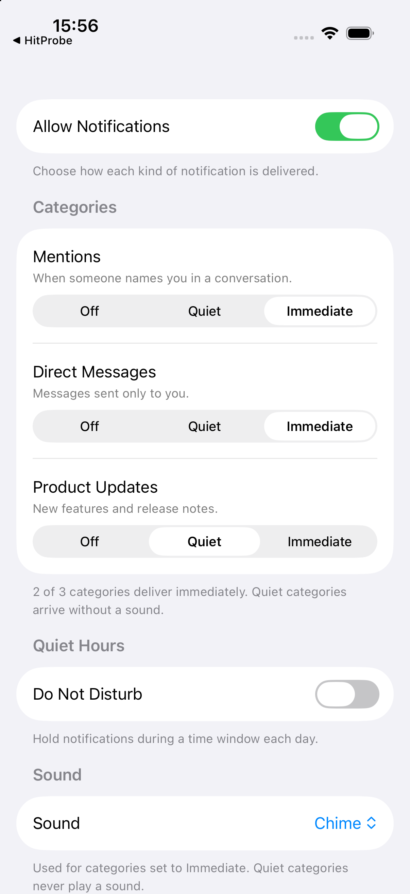
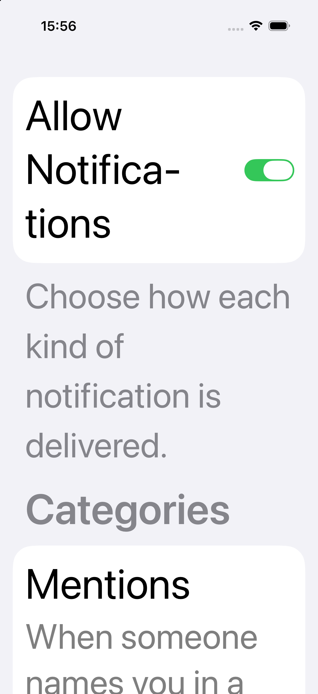

# Worked example: building a screen with the skill

The [review example](../apple-design-review/) tests whether the skill helps an agent *judge* an
existing screen. This one tests the other half: whether it helps an agent *build* one that does not
exist yet. The checklist asks for both, and they fail differently — a review can only be wrong about
code someone else wrote, while a build has to survive a compiler.

## Protocol

Same shape as the review example, and the traps were pre-registered for the same reason.

1. [`TASK.md`](TASK.md) was written with six traps deliberately embedded. The
   [expectations](expectations.md) naming them were written **before** the run and kept outside the
   agent's workspace.
2. A separate agent, in an isolated directory, received only the task and the skill. It was not told
   that traps existed, and it had no simulator.
3. Its output — [`NotificationSettingsView.swift`](NotificationSettingsView.swift) and
   [`NOTES.md`](NOTES.md) — is published exactly as produced.
4. Only then was it compiled, run, and audited.

## The traps, and what happened

| # | Trap | Outcome |
| --- | --- | --- |
| T1 | The obvious modern implementation needs iOS 17 API; the task says iOS 16 | **Avoided.** Used `ObservableObject`/`@Published`, not `@Observable`. Compiles clean at `-target arm64-apple-ios16.0-simulator`. |
| T2 | Off/Quiet/Immediate is three-state; a `Toggle` cannot express it | **Avoided.** Segmented control, with a documented swap to a menu at accessibility sizes. |
| T3 | Turning notifications off should not silently strand the categories | **Handled.** Hides them, states the alternative (disabling in place), and calls it defensible rather than settled. |
| T4 | A settings screen that duplicates what the system owns | **Avoided.** Defers OS-level permission to `UIApplication.openSettingsURLString` instead of pretending the app owns it. |
| T5 | The test action is async and can fail | **Handled.** Guards on `isSendingTest` for repeat protection, shows progress in the button, and reports success and failure as text plus symbol. |
| T6 | The "how many are Immediate" count is derived state | **Handled.** Computed property, not stored. |

Six for six, which is a better result than I expected when writing the task.

## What it looks like running

| Default text size | Largest accessibility size |
| --- | --- |
|  |  |

iPhone 17 Pro, iOS 26.5, light appearance. The screen was compiled at the iOS 16 floor and run to
produce these; the agent itself had no simulator and said so.

## Independently verified

The agent made specific claims. Rather than take them, I re-ran the ones that were checkable:

| Its claim | Result |
| --- | --- |
| Compiles at the iOS 16 floor | Confirmed. `swiftc -target arm64-apple-ios16.0-simulator` succeeds. |
| Warning-free | Confirmed with `-warnings-as-errors`; exit 0. |
| The availability floor is genuinely enforced | Confirmed. Injecting `ContentUnavailableView` fails with "only available in iOS 17.0 or newer", so the floor is real rather than asserted. |
| 13 cited HIG pages, read at the page | All 13 resolve against Apple's data API, including both section anchors. |
| No fabricated rule IDs | Confirmed: none present. |
| No copied numeric specifications | Confirmed: no point sizes, ratios, or colour literals in the notes or the code. |

## Claim discipline

- Cites a page **and** a section where the page has one.
- Labels its own preferences under a heading that says so: "Design suggestions, labelled as mine and
  not as Apple requirements".
- Has a section listing what it could **not** check, with what would settle each item. Dynamic Type
  is in it: "I reasoned about the AX-size swap; I did not see it."
- Distinguishes what it executed from what it reasoned about, and went further than asked by
  extracting the date logic into a host harness and running it against wrap-midnight cases.

## What this demonstrates, and what it does not

**Does:** on this task, the skill produced a screen that compiles at the stated deployment floor,
uses the control the guidance points to for a three-state choice, defers to the system where the
system owns the setting, and ships with notes that separate what was verified from what was not. The
six pre-registered traps were all avoided or handled.

**Does not:** one task, one run, one model, no control arm. A task designed by the same person who
wrote the skill may embed traps the skill happens to cover; that is a real limitation of this design
and not something the result can escape. It is a worked example, not a measurement.

One thing worth noting against my own interest: the AX-size control swap here is the same class of
adaptation I *failed* to implement in the review example's fixed screen, and had to be told about.
The agent working from the skill did it unprompted.
