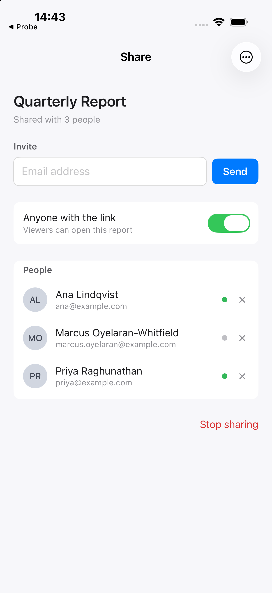
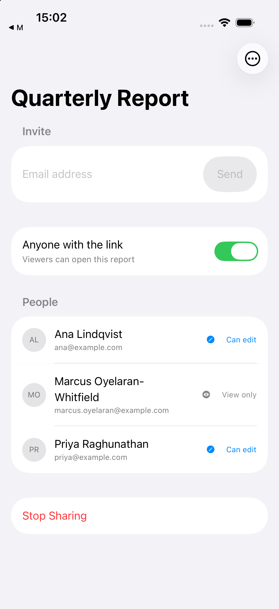
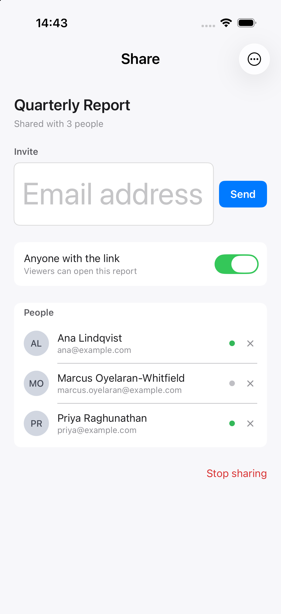
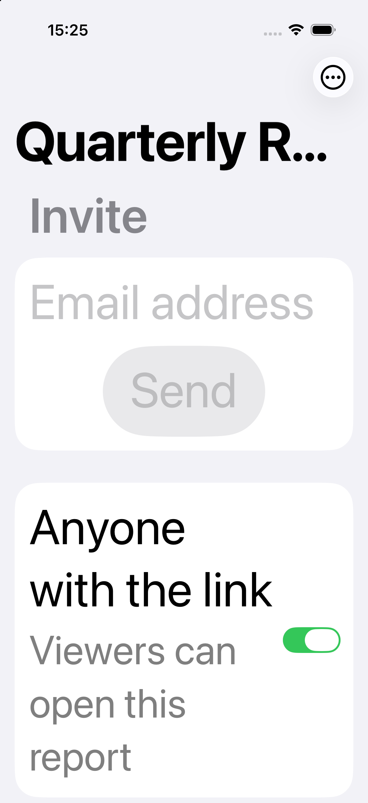

# Worked example: reviewing an iOS share screen

A real SwiftUI screen, reviewed with the [`apple-design`](../../skills/apple-design/) skill, then
fixed. Everything here is browsable without cloning: the code before and after, the review exactly
as it was produced, real simulator screenshots, and an honest account of what the review got wrong.

## Before and after

| | Before | After |
| --- | --- | --- |
| Light |  |  |
| Dark |  |  |
| Largest accessibility text |  |  |

Real captures from a running app on **iPhone 17 Pro, iOS 26.5**, Xcode 27.0. Per-capture settings,
as reported by the device after being set, are in
[`screenshots/before-conditions.txt`](screenshots/before-conditions.txt) and
[`screenshots/after-conditions.txt`](screenshots/after-conditions.txt).

The dark column is the clearest single result. Before, the light and dark captures differ in
**0.45 %** of pixels, and the only pixels that differ are ones the *system* drew. After, they differ
in **99.78 %**. That measures how much changed, not whether the result is good; the case for the
after screen is the image itself. Numbers and their instruments in
[`measurements.md`](measurements.md).

## The files

| File | What it is |
| --- | --- |
| [`before/ShareSheetView.swift`](before/ShareSheetView.swift) | The screen as reviewed |
| [`after/ShareSheetView.swift`](after/ShareSheetView.swift) | After applying the findings |
| [`REVIEW.md`](REVIEW.md) | The review, verbatim |
| [`scoring.md`](scoring.md) | What it got right, missed, and got wrong, adjudicated item by item |
| [`planted-defects.md`](planted-defects.md) | The defect list, written before the review |
| [`measurements.md`](measurements.md) | Measurements, their instruments, and their limits |
| [`probe/`](probe/) | The measurement probes and their raw output |
| [`build.sh`](build.sh) | Rebuilds either variant and recaptures the screenshots |

## How the review was run

The point of the exercise is that the result is not stage-managed, so the protocol matters:

1. The screen was written with defects, and the defect list was recorded **first**, outside the
   repository, where the reviewing agent could not reach it. The screen carries no comments.
2. A separate agent, in an isolated directory, was given only the screen, the skill, the three
   screenshots, and the platform context. It was **not** told that defects had been planted, how
   many there were, or what to look for.
3. Its review was captured as written. [`REVIEW.md`](REVIEW.md) is that file, including the
   corrections it made to its own numbers and the limits it declared.
4. Only then was it compared against the planted list.
5. Where the review and the planted list disagreed, the disagreement was settled by measuring the
   running app rather than by either party's assertion.

Step 5 is the one that earned its keep. See below.

## The most useful result is the one it got wrong

The screen's toolbar button declares `.frame(width: 24, height: 24)`. That looks like an easy
target-size finding, and the skill warns against filing exactly that kind of finding from the glyph
alone, because a small icon often sits inside a large target.

The review did the right thing: it measured the rendered Liquid Glass container at exactly
44.0 × 44.0 pt, refused to file a finding, and listed it as the screen's most likely false positive.

Then a [hit-test probe](probe/main.swift) showed the region that actually receives a touch is
**39.5 × 26.5 pt**. A sampled point at the container's corner resolves to the navigation bar, not
the button.

| Measurement of the same control | Value |
| --- | --- |
| Declared frame in the source | 24 × 24 pt |
| Rendered glass container in the screenshot | 44.0 × 44.0 pt |
| Region the hit-test probe reaches | **39.5 × 26.5 pt** |

That last row is programmatic hit-testing, not a finger on glass; real taps were not tested. Run it
yourself with `./probe/run.sh before`.

The guide says a screenshot cannot settle a hit-target question. The review said so too, in its own
limitations section. Both then treated a pixel measurement as if it had settled one. The lesson is
narrower and more useful than "the skill works": the visible-size trap has a mirror image, and
avoiding one direction is not the same as avoiding both.

## Summary of the comparison

Scored item by item in [`scoring.md`](scoring.md), including the two places where my own
pre-registered list was wrong rather than the review.

| | |
| --- | --- |
| Planted items, as written | 15 |
| Invalidated on audit (my error) | 1 |
| **Valid planted defects** | **14** |
| Found | **13** |
| Wrongly dismissed | 1 (the toolbar target, above) |
| **Real defects found that were not planted** | **4** |
| Adjudicated false positives | 0 |
| Disagreements with a pre-designated acceptable pattern | 1 |
| Correct patterns checked and left alone | 6 |
| Fabricated rule IDs | 0 |

The unplanted findings are the most informative row, since they are the part nobody staged. The best
of them: the "⋯" button silently toggles link sharing, which was written as filler and is a genuine
privacy-relevant defect.

## Remaining defect in the fixed version

At the largest accessibility text size the navigation bar's large title truncates to
"Quarterly R…". It is the system's large-title treatment rather than app-drawn text, and it is left
in place rather than worked around. Visible in [`after-xxxl.png`](screenshots/after-xxxl.png).

## Reproducing it

Requires Xcode and an iOS simulator.

```sh
./build.sh before      # compile, install, and capture the three "before" screenshots
./build.sh after       # same for the fixed version
./probe/run.sh after   # where a touch lands, by hit-testing a 0.5 pt grid
./probe/sizes.sh after # what SwiftUI laid out, via GeometryReader
```

There is no Xcode project: each variant is one Swift file compiled directly against the simulator
SDK with a small harness, so the reviewed code stays readable on GitHub.

## Scope

One screen, one review, one platform, one model, no control arm. It shows what this skill produced
on this task, in enough detail to judge. It is not a measurement of how well the skill performs in
general, and the numbers above should not be quoted as one.
