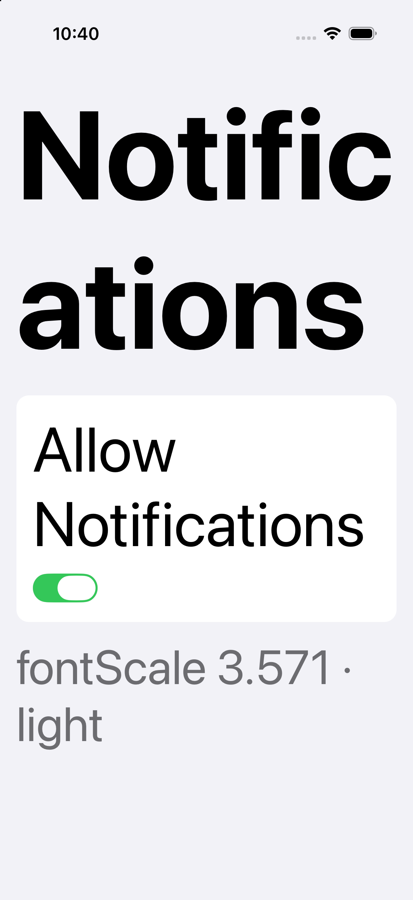
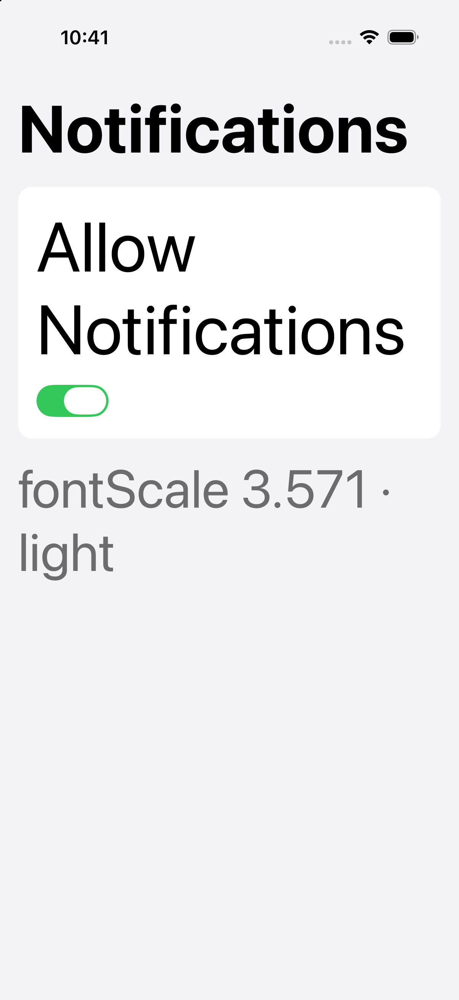

# React Native pilot

Whether the Apple guidance in this bundle survives contact with a framework that is not Apple's.

The [review](../apple-design-review/) and [build](../apple-design-build/) examples are SwiftUI. This
one rebuilds the same notification-settings screen in React Native and runs it, because a framework
reference written without running anything would be exactly the kind of unverified claim the rest of
this repository refuses to publish.

**Environment:** React Native 0.76.5, New Architecture (Fabric, bridgeless), built with
`xcodebuild` (Xcode 27.0), run on iPhone 17 Pro simulator / iOS 26.5.

Everything below is regenerable: see [`harness/`](harness/) for the pinned scaffold, the variants,
the build-and-capture runner, and the measurement tool.

## This pilot was audited, and it was wrong twice

The first pass published two conclusions that an audit overturned, both by missing an API that the
pinned release already had:

| First pass said | Actually |
| --- | --- |
| "no semantic system colours: you maintain the palette" | `PlatformColor` and `DynamicColorIOS` exist and map 33 native colour names |
| use `allowFontScaling={false}` for the title | `dynamicTypeRamp` works, routes through `UIFontMetrics`, and keeps scaling on |
| "no native implementation reads `maxFontSizeMultiplier`" | legacy iOS **does** implement it; the Fabric iOS text path does not |
| `accessibilityLiveRegion` to announce a change | `@platform android`; a no-op on the iOS screen it was recommended for |

It also could not be re-run: the app directory was outside the repo and the percentages were
assertions. That is what `harness/` fixes.

The lesson is not subtle. Testing three ways to solve a problem tells you which of the three works,
not whether the right answer was among them. Searching the framework's own source first would have
found `dynamicTypeRamp` in about a minute.

## What it found

The screen was written to *follow* the guidance: semantic roles, stacked layout at large text sizes,
`hitSlop` on small controls. Then it was run at the largest accessibility size, and broke anyway.

| | Uncapped | Fixed with `dynamicTypeRamp` |
| --- | --- | --- |
| Largest accessibility size |  |  |

At AX5 this device reports `fontScale = 3.571`, so an uncapped 34 pt title renders near 121 pt and
wraps to "Notific / ations". OCR of the captures confirms the wrap and confirms all variants ran at
the same `fontScale`.

### Six variants, one clean build each

From [`harness/results.tsv`](harness/results.tsv), regenerated from a clean `git clone` via
`./bootstrap.sh && ./run-variants.sh`:

| Variant | Pixels differing vs uncapped | Result |
| --- | --- | --- |
| `dynamicTypeRamp="largeTitle"` | 53.41% | **Works, scaling stays on.** |
| `allowFontScaling={false}` + size | 51.58% | Works, never scales again. |
| `maxFontSizeMultiplier={1.4}` | **0.00%** | **Identical. Did nothing.** |
| inline `Math.min` cap | 55.26% | Worse; RN re-scales the computed size. |
| `PlatformColor` palette | 53.41% | Works; 99.78% light-vs-dark with no palette of its own. |
| **control:** edited title text | 53.15% | Edits reach the build. |

The control matters. "The screenshot did not change" has a boring explanation (the build never
picked up the edit) and an interesting one (the prop does nothing). The control rules out the boring
one on every run, so the 0.00% means what it says.

### Why `maxFontSizeMultiplier` does nothing here

Narrower than the first pass claimed, and reproducible with
[`harness/inspect-source.sh`](harness/inspect-source.sh):

- `Libraries/Text/RCTTextAttributes.mm:249` caps it with `fminf(...)` — the **legacy** renderer.
- In `ReactCommon`, the prop name appears only under **Android TextInput**.
- `RCTParagraphComponentView.mm`, Fabric's iOS text view: **zero** occurrences.

Implemented for the old renderer, absent from the new one. An app on the New Architecture gets no
cap, and nothing warns you.

## The reference this produced

[`frameworks/react-native.md`](../../guidance/apple-design/references/frameworks/react-native.md),
covering where RN makes the app do what SwiftUI does for you: text scaling, colour, interaction
bounds, and hand-built accessibility semantics. Every claim in it is now labelled **[source]**,
**[measured]**, or **[untested]**, because those are different kinds of evidence and the first
version presented them as one.

## Not established

- **VoiceOver was not run.** Roles and labels are in the code, unheard. This is the biggest gap.
- **iOS only, simulator only.** No Android, no device, so touch behaviour is inferred from layout.
- **One RN version, one OS, one device.** The `maxFontSizeMultiplier` result is specific to 0.76.5
  on Fabric; `inspect-source.sh` re-answers it for another version in seconds.
- **Pixel percentages detect change, they do not rank quality.** 53.41% vs 51.58% says nothing about
  which screen is better. Only the 0.00% carries weight.
- **That zero needed a correction.** Reproducing from a clean clone gave 0.06%, because the
  simulator clock advances between builds and the first run happened to capture both variants in
  the same minute. The measurement now excludes the status bar. The finding survives; the original
  claim of "byte-identical" whole screenshots did not.
- One screen. No control arm on the guidance itself: this pilot shows what RN does, not whether the
  guidance improved anyone's outcome.
