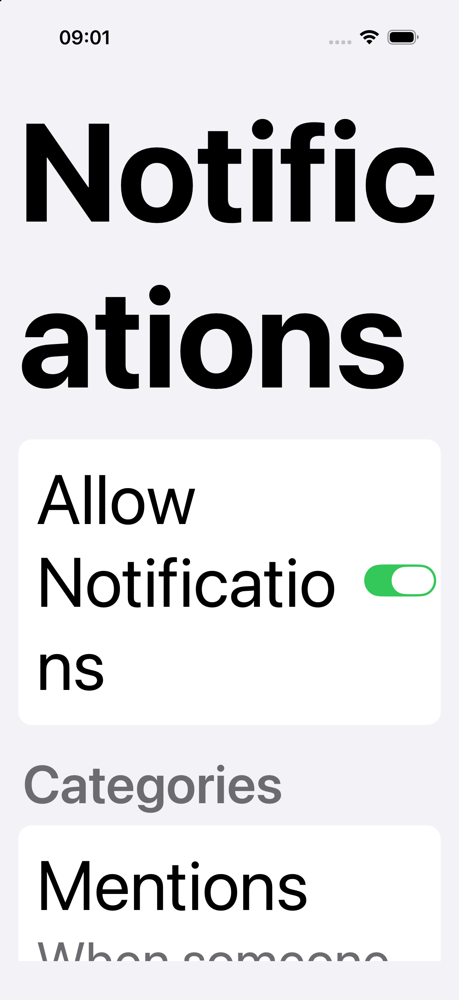
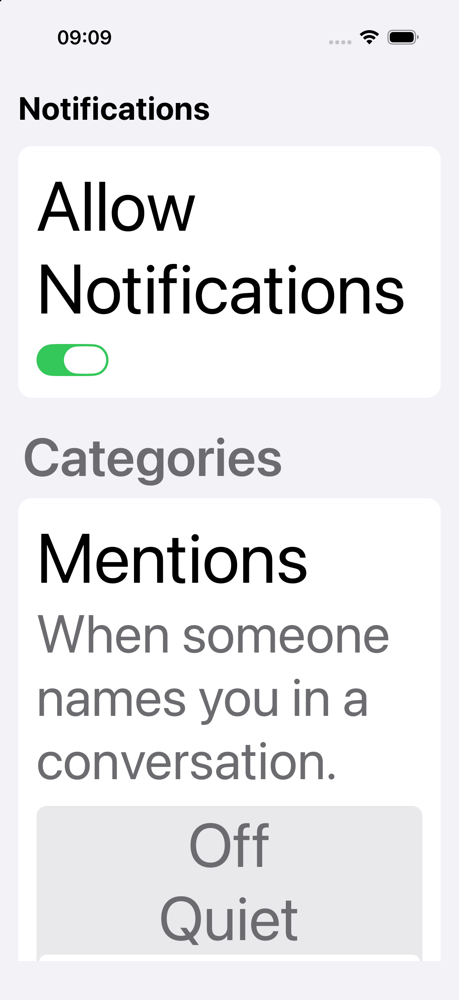
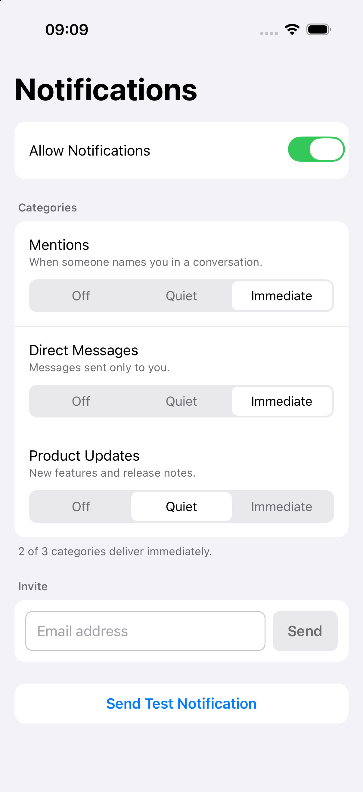
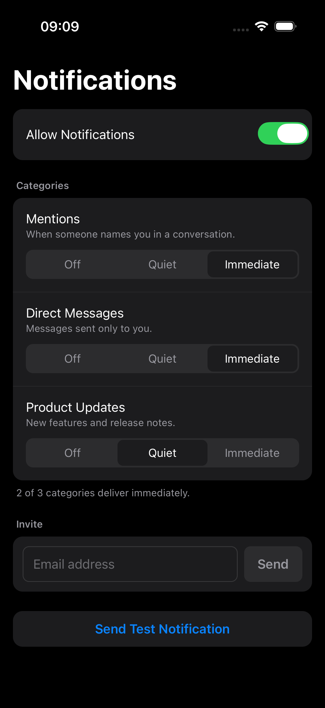

# React Native pilot

Whether the Apple guidance in this bundle survives contact with a framework that is not Apple's.

The [review](../apple-design-review/) and [build](../apple-design-build/) examples are SwiftUI. This
one rebuilds the same notification-settings screen in React Native and runs it, because a framework
reference written without running anything would be exactly the kind of unverified claim the rest of
this repository refuses to publish.

**Environment:** React Native 0.76.5, New Architecture (Fabric, bridgeless), built with
`xcodebuild`, run on iPhone 17 Pro / iOS 26.5.

## What it found

The screen was written to *follow* the guidance: semantic roles, stacked layout at large text sizes,
`hitSlop` on small controls, a hand-maintained dark palette. Then it was run, and the largest
accessibility text size broke it anyway.

| | Before | After |
| --- | --- | --- |
| Largest accessibility size |  |  |

The title reads "Notific / ations" in the before capture. At AX5 this device reports
`fontScale = 3.571`, so an uncapped 34pt title renders at roughly 121pt.

**Three fixes were tried. Two failed silently, which is the finding worth having:**

| Approach | Result |
| --- | --- |
| `maxFontSizeMultiplier={1.4}` | **No effect at all.** Pixel-identical to uncapped. |
| Inline `fontSize: Math.min(34 * fontScale, 34 * 1.4)` | **Worse.** RN scales the computed size again, so the cap compounds. |
| `allowFontScaling={false}` + an explicit size | **Works.** 58% of pixels changed. |

The `maxFontSizeMultiplier` result was confirmed at the source: the prop is declared in RN's
`TextProps.js`, and no native implementation in the installed Pods reads it. It fails quietly, which
is the worst way for an accessibility prop to fail.

A control test ruled out the obvious explanation: editing the title's *text* changed 42.63% of
pixels, so edits were reaching the app. The prop genuinely does nothing.

## Light and dark

| Light | Dark |
| --- | --- |
|  |  |

Light and dark differ in **99.78%** of pixels, which confirms the hand-maintained palette is
switching. RN has no semantic system colours, so this is entirely the app's work, and a near-zero
figure would have meant the setting was being ignored.

## The reference this produced

[`frameworks/react-native.md`](../../guidance/apple-design/references/frameworks/react-native.md),
covering the four areas where RN makes the app do what SwiftUI does for you: text scaling,
interaction bounds (`hitSlop` instead of `contentShape`), hand-built accessibility semantics, and a
manual dark palette.

## Not established

- **VoiceOver was not run.** Roles and labels are in the code, unheard.
- **iOS only, simulator only.** No Android, no device, so touch behaviour is inferred from layout.
- **One RN version.** The `maxFontSizeMultiplier` finding is specific to 0.76.5 and may be fixed
  later; the reference says to re-test rather than trust it.
- One screen, one framework version, no control arm.
